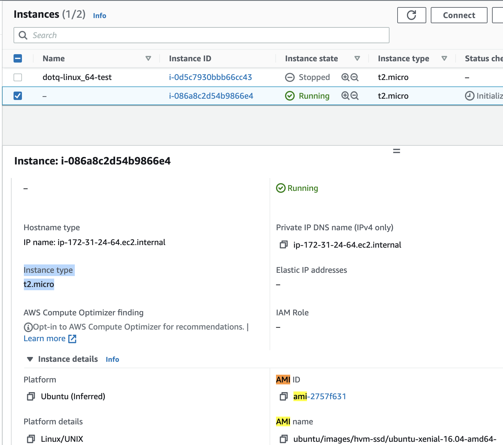
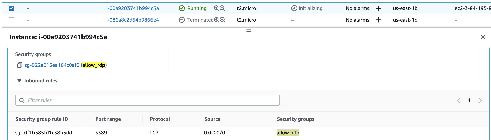

# aws-terraform-demo 🐳


[](https://github.com/tquangdo/aws-terraform-demo/issues/new)

## reference
[youtube](https://www.youtube.com/watch?v=RA1mNClGYJ4&list=PLQP5dDPLts65J8csDjrGiLH5MZgTyTsDB)

## install terraform
```shell
terraform -version
->
Terraform v1.1.4
on darwin_amd64
```

## ec2
- create `ec2.tf`
```shell
terraform init
terraform apply
->
    + delete_on_termination = (known after apply)
          + device_name           = (known after apply)
          + encrypted             = (known after apply)
          ...
        }
    }

Plan: 1 to add, 0 to change, 0 to destroy.

Do you want to perform these actions?
  Terraform will perform the actions described above.
  Only 'yes' will be accepted to approve.

  Enter a value: yes

aws_instance.example: Creating...
aws_instance.example: Creation complete after 1m20s [id=i-086a8c2d54b9866e4]

Apply complete! Resources: 1 added, 0 changed, 0 destroyed.
```
- will see the result:

- destroy
```shell
terraform destroy
->
Plan: 0 to add, 0 to change, 1 to destroy.

Do you really want to destroy all resources?
  Terraform will destroy all your managed infrastructure, as shown above.
  There is no undo. Only 'yes' will be accepted to confirm.

  Enter a value: yes

aws_instance.example: Destroying... [id=i-086a8c2d54b9866e4]
```

## s3
- create bucketname=`dtq-terraform`
- create `s3.tf`
```shell
terraform init && terraform apply
-> `terraform.tfstate` output in bucket, instead of project 
terraform destroy
```

## split
- create folder=`split` & 3 files "*.tf"
```shell
cd split && terraform init && terraform apply
```
- ->

```shell
terraform destroy
```

## input var
### A)
- create folder=`var` & 3 files "*.tf"
```shell
cd var && terraform init && terraform apply
->
var.ec2_type
  Enter a value: t2.micro

var.instance_count
  Enter a value: 
```
### B)
- we can call input param in CMD like:
```shell
terraform apply -var 'ec2_type=t2.micro'
->
var.instance_count
  Enter a value: 
```
### C)
- create `terraform.tfvars`
```shell
terraform apply # If *.tfvars has different name from `terraform.tfvars`, we need CMD: terraform apply  -var-file="vars.tfvars"
-> will NOT prompt GUI input
terraform destroy
```