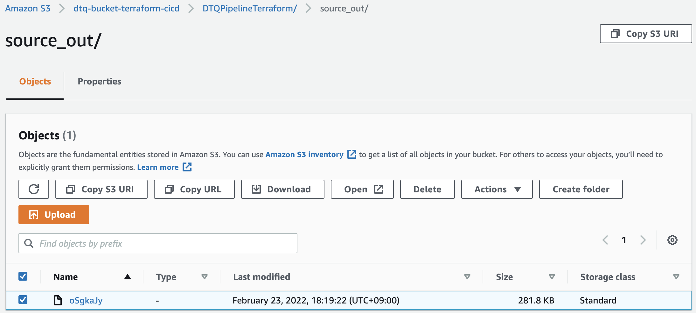

# aws-terraform-demo 🐳


[](https://github.com/tquangdo/aws-terraform-demo/issues/new)

## reference
[youtube](https://www.youtube.com/watch?v=RA1mNClGYJ4&list=PLQP5dDPLts65J8csDjrGiLH5MZgTyTsDB)

## terraform help
1. ### get
    - Downloads and installs modules needed for the configuration given by PATH.

## install terraform
```shell
terraform -version
->
Terraform v1.1.4
on darwin_amd64
```

## [var] folder
1. ### input console
    - create folder=`var` & 3 files "*.tf"
    ```shell
    cd var && terraform init && terraform apply -auto-approve
    ->
    var.ec2_type
        Enter a value: t2.micro

    var.instance_count
        Enter a value: 
    ```
1. ### input param
    - we can call input param in CMD like:
    ```shell
    terraform apply -var 'ec2_type=t2.micro'
    ->
    var.instance_count
        Enter a value: 
    ```
1. ### terraform.tfvars
    - create `terraform.tfvars`
    ```shell
    terraform apply # If *.tfvars has different name from `terraform.tfvars`, we need CMD: terraform apply  -var-file="vars.tfvars"
    -> will NOT prompt GUI input
    terraform destroy
    ```

## [ec2] folder
1. ### ubuntu
    
1. ### linux
    

## [s3] folder


## [codebuild] folder
1. ### use "terraform template_file"
    - `codebuild/main.tf`: `data "template_file" "policy" {...}`
1. ### AWS result (after click "Start build")
    1. #### IAM role & policy
        
    1. #### codebuild
        
        ---
        
        ---
        
    1. #### S3
        
    1. #### cloudwatch log group & stream
        

## [cicd] folder
1. ### reference
    [codepipeline](https://registry.terraform.io/providers/hashicorp/aws/latest/docs/resources/codepipeline)
1. ### terraform CLI
    1. #### validate
        ```shell
        cicd$ terraform validate
        => Success! The configuration is valid.
        ```
    1. #### plan
        ```shell
        cicd$ terraform plan -out tform_plan.out
        => 
        var.var_codebuild_projname
            Enter a value: DTQCodeBuildProjTerraform
            ...
        Plan: 5 to add, 0 to change, 0 to destroy.
        Saved the plan to: tform_plan.out
        ```
    1. #### apply
        ```shell
        cicd$ terraform apply tform_plan.out
        => Apply complete! Resources: 5 added, 0 changed, 0 destroyed.
        ```
1. ### AWS result
    1. #### IAM role & policy for codbuild
        > policy is according to `cicd/main.tf > "arn:aws:iam::aws:policy/AWSCodeBuildAdminAccess"`

        
    1. #### IAM role & policy for pipeline
        
    1. #### S3
        
    1. #### codebuild
        > `cicd/codebuild.tf` using "module"

        
        ---
        
    1. #### pipeline
        

## [pipeline_be] folder

1. ### reference
    [classmethod](https://dev.classmethod.jp/articles/simple-terraform-cicd-pipeline-with-aws-codepipeline/)
1. ### s3
    - name=`dtq-bucket-terraform-cicd`
1. ### dynamodb
    - name=`DTQDynamoDBTerraformStateLock`
1. ### codecommit
    - name=`DTQPipelineTerraformCICD`
    - create=`README.md`
    - copy paste from `pipeline_be` folder (Ex: `buildspec.yml`) and `git push`
1. ### pipeline
    
    - => will create output for `S3:dtq-bucket-terraform-cicd`, `S3:dtq-cm-terraform-000` & `DynamoDB`
    
    ---
    
    ---
    
1. ### run terraform
    1. #### no change
        - `terraform apply -refresh-only` => show "Apply complete! Resources: 0 added, 0 changed, 0 destroyed."
    1. #### change
        - create `test` folder with `s3.tf` to create bucket=`dtq-cm-terraform-009`
        - `terraform apply -refresh-only` => show "Apply complete! Resources: 1 added, 0 changed, 0 destroyed."
        
        - download `terraform.tfstate` from `S3:dtq-bucket-terraform-cicd` and compare with "no change"
        
1. ### delete AWS resources
    `pipeline_be$ ./del_aws_resource.sh`
